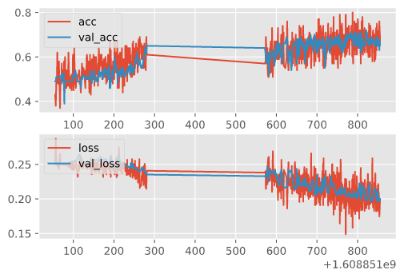
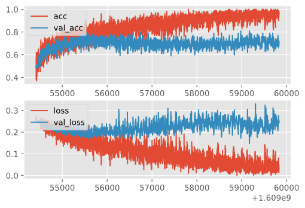

# Convolutional Neural Network on Cats and Dogs

- Developed and trained a Convolutional Neural Network (CNN) with PyTorch to differentiate images between cats and dogs
- Explore the application of Convolutional Neural Network and PyTorch

## When the model is trained in a short period of time

## When the model is trained for a long period of time
